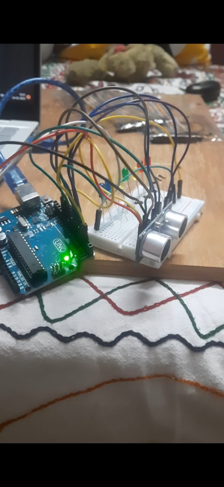

# Led-Distance-Indicator

# Code 

 Pin.no must be followed properly while constructing the circuit 
 
# Output 

 It Measures Distance & Indicate it in Led accordingly 
<ul>
   <li>5cm=Red</li>
  <li>7cm=Red</li>
  <li>10cm=Yellow</li>
  <li>15cm=Green</li>
  <li>17cm=Yellow</li>
  <li>20cm=Blue</li>
  <li>25cm=Blue</li>
</ul>
By Going thtough the code we can easily change the led color & distance
